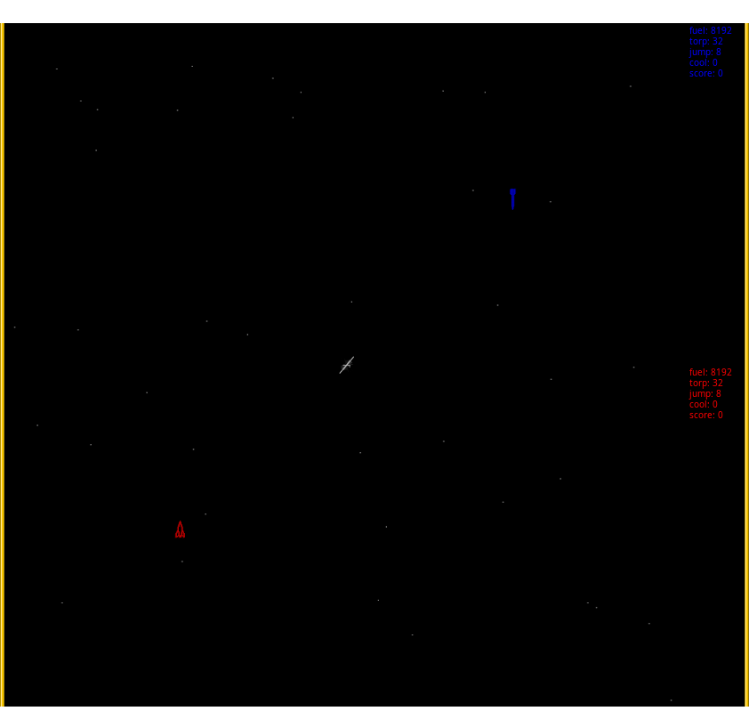

Spacewar!
=========

A 2 player game from 1962.

Originally for the PDP-1, now available for Haiku.

Keys:
* player 1: w, a, s, d
* player 2: p, l, ;, ' or arrow keys or keypad 8, 4, 5, 6

Press both left and right to go into hyperspace. Beware, it may randomly destroy
the ship!

You can also use gamepads, in which case up or down triggers hyperspace.
Buttons 1 and 2 trigger fire and thrust.

Gamepads are detected while the game is running and will be used automatically.
However, when a gamepad is plugged, keyboard controls are no more available for
that player.

